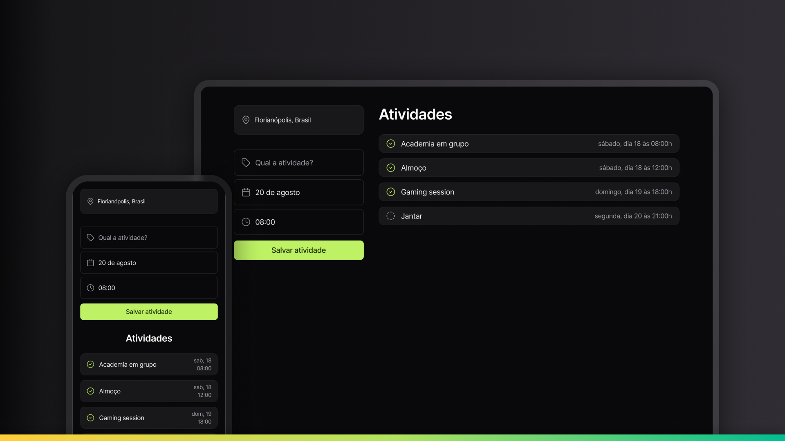

# Plann.er - Activity Manager

  
  
  
  

## 📱 Demo

## 📋 About the Project

**Plann.er** is a web application for daily activity management. Developed with pure HTML, CSS, and JavaScript, this project offers a clean and minimalist interface with a dark theme to organize your tasks.

Users can add new activities, select specific dates and times, mark activities as completed, and view the complete task history. The responsive design allows comfortable use on both mobile devices and desktops.

## ✨ Features

- Add new activities with name, date, and time
- Check for already scheduled times to avoid overlapping
- Mark activities as completed/uncompleted
- View activities with user-friendly date formatting
- Responsive layout (mobile-first)
- Dark theme interface
- Smooth animations for better user experience

## 🚀 Technologies Used

- **HTML5** - Semantic content structuring
- **CSS3** - Modern styling with flexbox, grid, and animations
- **JavaScript (ES6+)** - DOM manipulation and application logic
- **Day.js** - Lightweight library for date manipulation
- **LocalStorage API** (prepared for future implementation)

## 💡 Applied Concepts

- **Mobile-first Design** - Layout primarily developed for mobile devices
- **DOM Manipulation** - Dynamic manipulation of HTML elements
- **Event Handling** - Capturing and handling user events
- **Form Data Processing** - Processing form data
- **Array Methods** - Use of advanced methods like `find()` and `filter()`
- **Template Literals** - Construction of dynamic strings
- **Date Formatting** - Custom date formatting
- **Arrow Functions** - Modern syntax for functions
- **Conditional Rendering** - Conditional rendering of elements
- **CSS Animations** - Animations to improve user experience
- **CSS Variables** - Use of variables for design consistency
- **CSS Grid/Flexbox** - Advanced and responsive layouts
- **Media Queries** - Adaptation for different screen sizes

## 🌐 Demo

Access the online version: [Plann.er](https://maurodiogodev.github.io/planner-static/)

## 🔜 Future Improvements

- Data persistence with localStorage
- Option to edit existing activities
- Categorization of activities by type
- Notifications for upcoming activities
- Toggle between light/dark mode
- Productivity statistics

Design UI/UX by [Rocketseat](https://www.rocketseat.com.br/)

---

 
Developed with ❤️ as part of my web development learning journey.
 
Feel free to contribute or get in touch!
 

